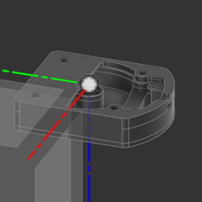
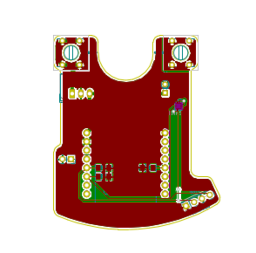

# pdjr-mast-multisensor

This project implements an
[ESP8266](https://www.espressif.com/en/products/socs/esp8266)-based
multisensor which mounts at the top of
[Beatrice](https://www.pdjr.eu/beatrice/wp-content/uploads/2021/01/beatrice.jpg)'s
mast and reports temperature, humidity, barometric pressure, lux and mast
state (raised/lowered).

The multisensor PCB is housed in a 3D printed enclosure which sits
between the mast top plate and the
[DHR35 Anchor Light](https://www.dhr.nl/dhr-marine/products/navigation-lights/dhr35).
The housing adds about 2cm to the mast height.

The PCB incorporates the following active components.

* [Wemos D1 Mini](https://www.wemos.cc/en/latest/d1/d1_mini.html)
* [Adafruit AM2320](https://www.adafruit.com/product/3721) temperature + humidity sensor
* [Bosch BMP581](https://www.bosch-sensortec.com/products/environmental-sensors/pressure-sensors/bmp581/) temperature + barometric pressure sensor
* [SW-520D](https://www.switchelectronics.co.uk/products/sw520d-ball-tilt-vibration-switch) tilt sensor
* [VEML7700](https://www.vishay.com/docs/84286/veml7700.pdf) lux sensor

The multisensor is configured and provisioned using
[ESPHome](https://esphome.io/index.html),
connects to the ships's WiFi network and integrates with the vessel's
[Home Assistant](https://www.home-assistant.io/)
platform.

<table>
  <tr>
    <td>
           
    </td>
    <td>
      
    </td>
  </tr>
</table>
